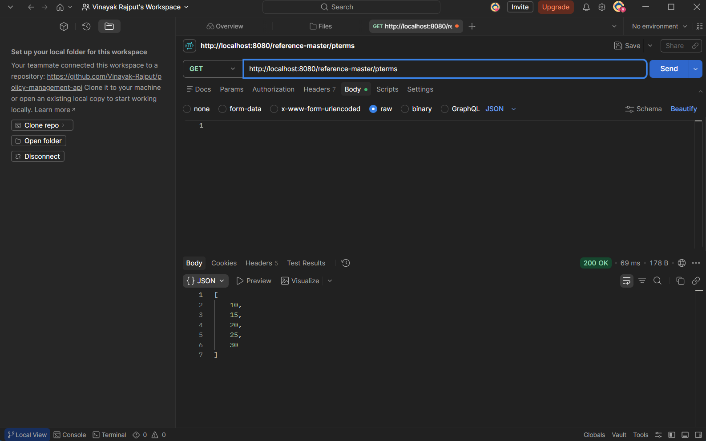
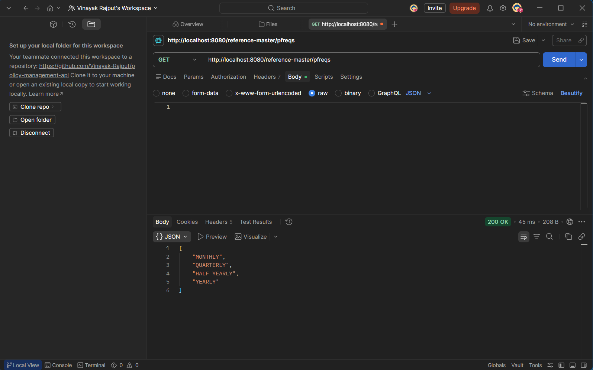
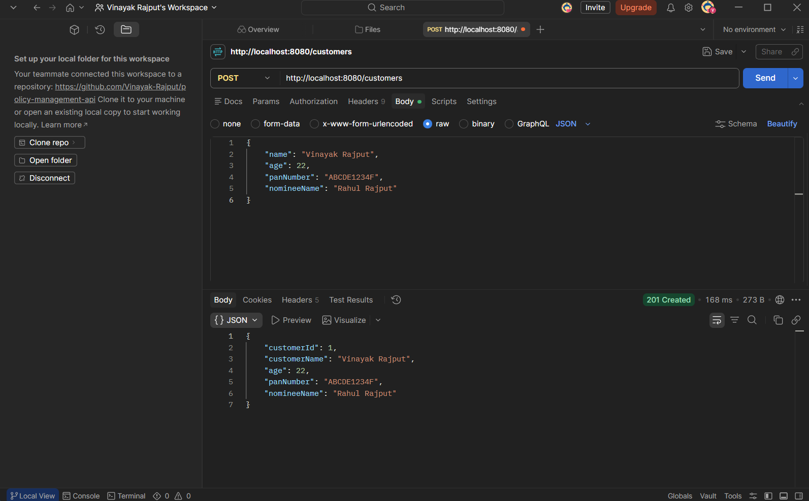
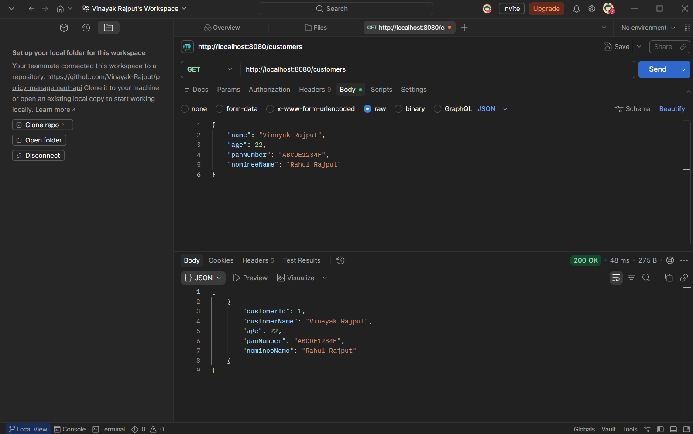
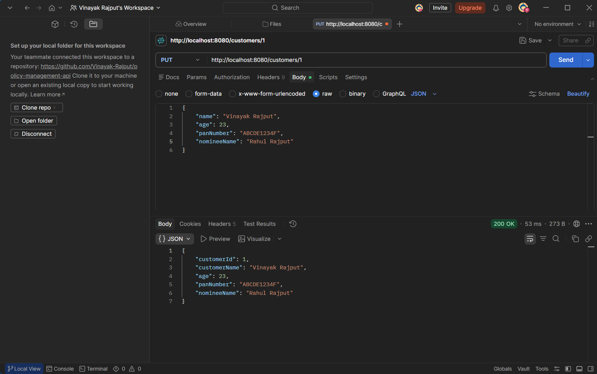
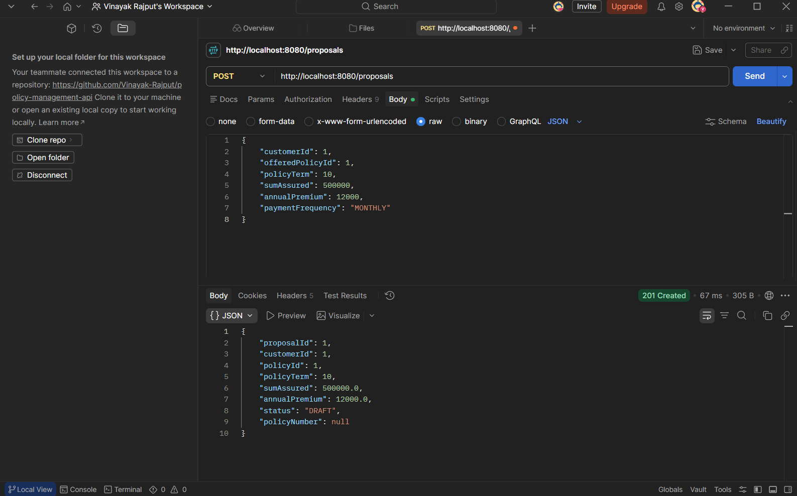
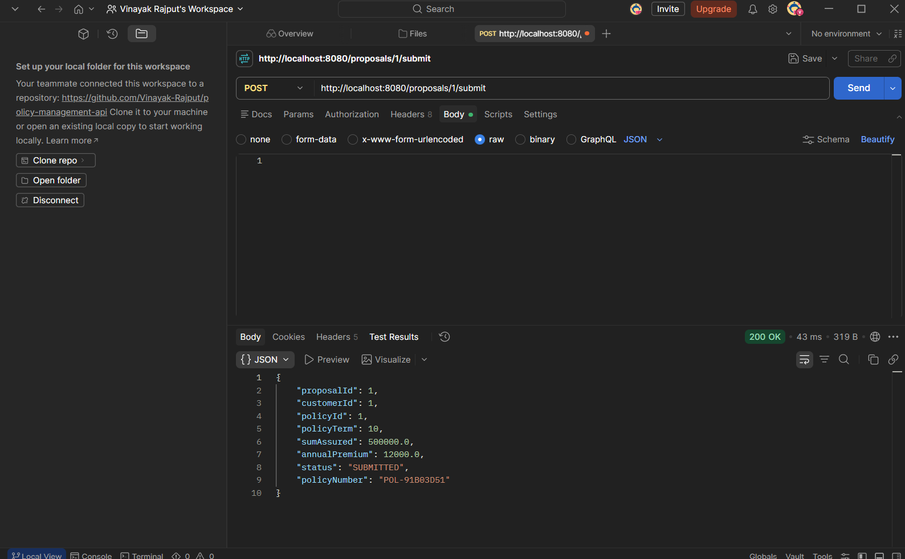
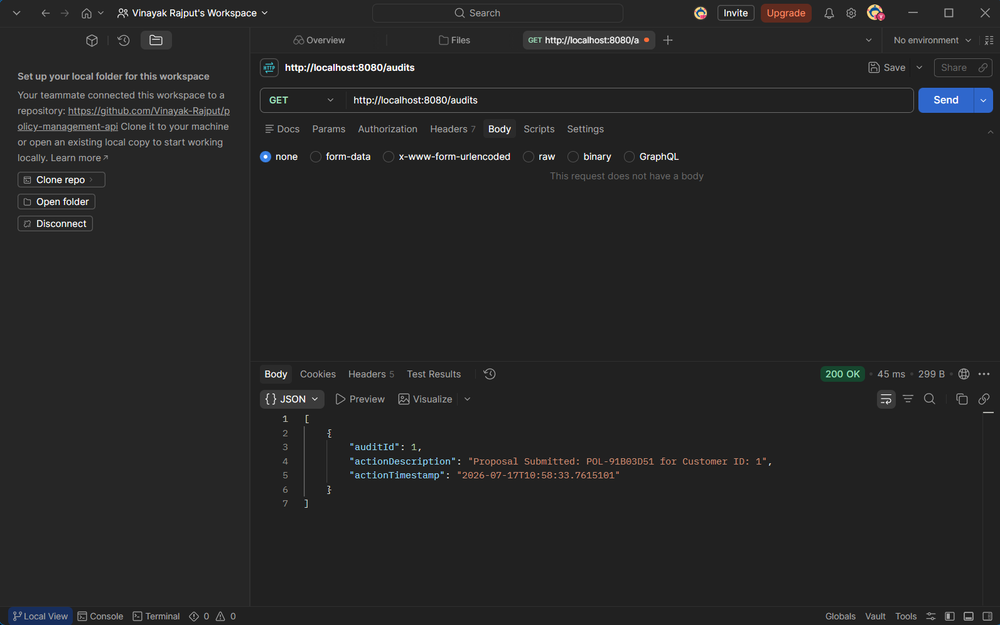

# Policy Management API

## Project Overview
Built with Spring Boot for managing both customers and policy proposals. It has a completely in-memory data store, and a layered architecture with files divided into Repositories, Services and Controllers for managing storage, basic business logic and checking constraints and business logic on data being entered.

## Tech Stack
* **Language:** Java 21
* **Framework:** Spring Boot 3.3.0
* **Validation:** Jakarta Bean Validation
* **Build Tool:** Maven
* **Storage:** Thread-safe ConcurrentHashMap (In-Memory)
* **Testing:** Postman, JUnit 5, Mockito

## Setup Instructions
### Prerequisites
* **Java:** JDK 17 or higher
* **IDE:** VS Code (with Extension Pack for Java) or IntelliJ IDEA
* **Testing:** Postman VS Code Extension (or desktop app)

### Running the Application
1. Clone the repository and open the project in your terminal.
2. Run the following command to start the Spring Boot server using the Maven wrapper:

   .\mvnw spring-boot:run

## API List

1. *Customer Management*

Create a Customer: POST /customers
Request Body:

JSON
{
    "name": "Jane Doe",
    "age": 28,
    "panNumber": "ABCDE1234F",
    "nomineeName": "John Doe"
}

Success Response (201 Created): Returns the customer object with a generated customerId.

Update a Customer: PUT /customers/{id}
Request Body: Same as POST, containing updated fields.

Success Response (200 OK): Returns the updated customer object.

2. *Proposal Management*

Step 1: Create a Draft Proposal: POST /proposals
Request Body:

JSON
{
    "customerId": 1,
    "offeredPolicyId": 1,
    "policyTerm": 10,
    "sumAssured": 500000,
    "annualPremium": 12000,
    "paymentFrequency": "MONTHLY"
}
Success Response (201 Created):

JSON
{
    "proposalId": 1,
    "customerId": 1,
    "status": "DRAFT",
    "policyNumber": null,
    ...
}

Step 2: Submit the Proposal: POST /proposals/{id}/submit
Request Body: None

Success Response (200 OK): Updates status to SUBMITTED and generates a policyNumber.

3. *Customer Management*

GET /customers: Fetch all customers.
GET /customers/{id}: Fetch a specific customer.

4. *Proposals Management*

GET /proposals: Fetch all proposals.
GET /proposals/{id}: Fetch a specific proposal.

5. *ReferenceMaster Management*

GET /reference-master/policy-terms: Returns static valid terms [10, 15, 20, 25, 30].

6. *Audit Management*

GET /audits: Returns a list of strings confirming all successful proposal submissions.

## Sample Requests/Responses

Screenshots of various Requests/Responses using Postman

## Test Execution Steps
1. *Automated JUnit 5 Tests*

To run the automated test suite, execute the following command in your terminal:
    .\mvnw test

Expected Output: BUILD SUCCESS indicating all assertions and business rule validations passed.

2. *Manual API Testing (Postman)*

* Open the project in VS Code.
* Install the Postman Extension.

The extension will automatically read the .postman directory included in the root of this project.

* Use the pre-configured requests to test the Create, Read, Update, and Submit flows end-to-end.

*Developed By Vinayak Rajput*